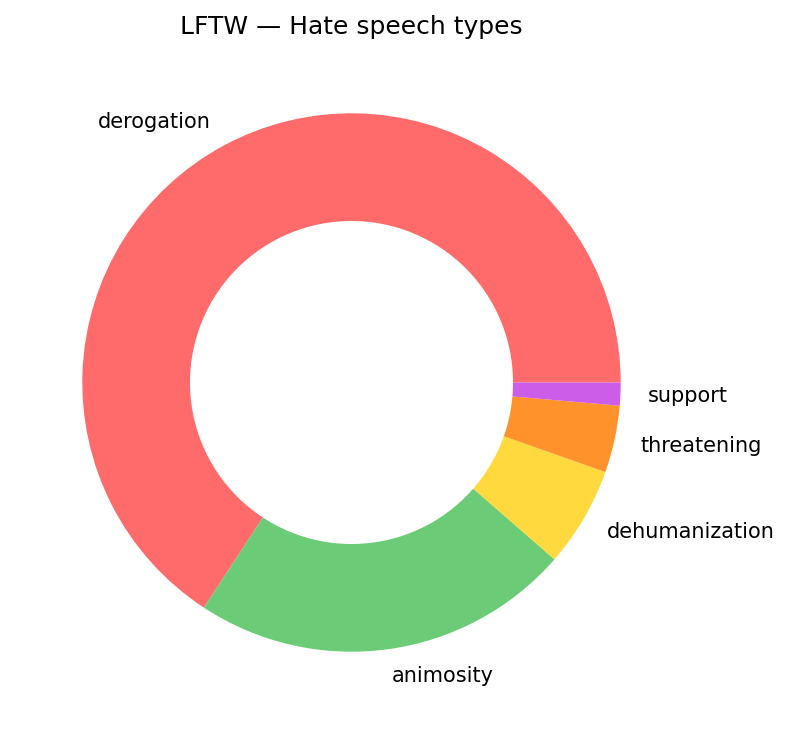

# Dataset Statistics

---

## 1. Learning from the Worst (LFTW)

**Total hate speech rows:** 15,065

### Hate Speech Types

| Type | Count | % of Total |
|------|------:|----------:|
| Derogation | 9,907 | 65.8% |
| Animosity | 3,439 | 22.8% |
| Dehumanization | 906 | 6.0% |
| Threatening | 606 | 4.0% |
| Support | 207 | 1.4% |

### Top 15 Targets

| Target | Count |
|--------|------:|
| Women (`wom`) | 2,035 |
| Black people (`bla`) | 1,961 |
| Jewish people (`jew`) | 1,096 |
| Muslim people (`mus`) | 1,002 |
| Trans people (`trans`) | 792 |
| Gay people (`gay`) | 724 |
| Immigrants (`immig`) | 672 |
| Disabled people (`dis`) | 489 |
| Refugees (`ref`) | 470 |
| South Asian people (`asi.south`) | 338 |
| Arab people (`arab`) | 338 |
| Chinese people (`asi.chin`) | 278 |
| Gay men (`gay.man`) | 271 |
| Non-white people (`non.white`) | 260 |
| Gay women (`gay.wom`) | 246 |

---

## 2. Social Bias Inference Corpus (SBIC)

**Total rows:** 35,424

### Numeric Label Statistics

| Field | Mean | Std Dev | Description |
|-------|-----:|--------:|-------------|
| `intentYN` | 0.484 | 0.393 | Probability of harmful intent |
| `sexYN` | 0.095 | 0.267 | Probability of sexual content |
| `offensiveYN` | 0.504 | 0.430 | Probability of being offensive |

### Target Coverage

| Field | Rows with Data | Coverage |
|-------|---------------:|---------:|
| `targetMinority` | 12,129 / 35,424 | 34.2% |
| `targetCategory` | 12,129 / 35,424 | 34.2% |
| `targetStereotype` | 12,126 / 35,424 | 34.2% |

### Target Categories

| Category | Count |
|----------|------:|
| Race | 3,883 |
| Gender | 3,535 |
| Culture | 2,471 |
| Victim | 2,027 |
| Disabled | 753 |
| Social | 642 |
| Body | 441 |

### Top 10 Target Minorities

| Minority | Count |
|----------|------:|
| Women | 2,796 |
| Black folks | 2,788 |
| Jewish folks | 969 |
| Assault victims | 680 |
| Muslim folks | 480 |
| Gay men | 358 |
| Mass shooting victims | 315 |
| Terrorism victims | 302 |
| Physically disabled folks | 296 |
| Asian folks | 263 |

### Top 10 Target Stereotypes

| Stereotype | Count |
|------------|------:|
| Trivializes harm to victims | 1,344 |
| Women are sex objects | 229 |
| Black people are criminals | 220 |
| Women are bitches | 165 |
| Muslims are terrorists | 151 |
| Women are hoes | 118 |
| Women are stupid | 102 |
| Women are property | 101 |
| Black people are inferior | 101 |
| Black folks are criminals | 97 |

