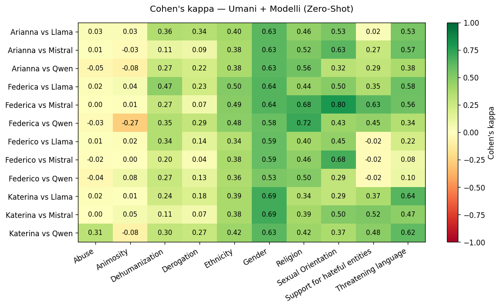
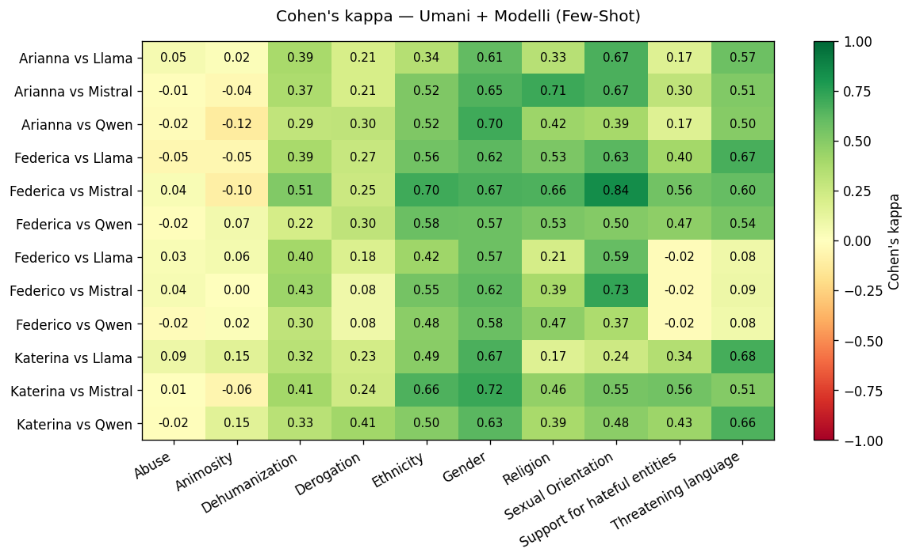
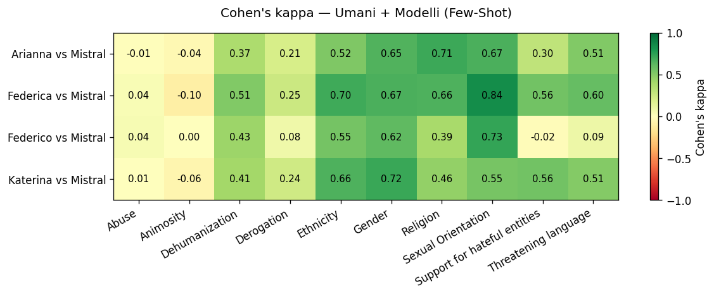
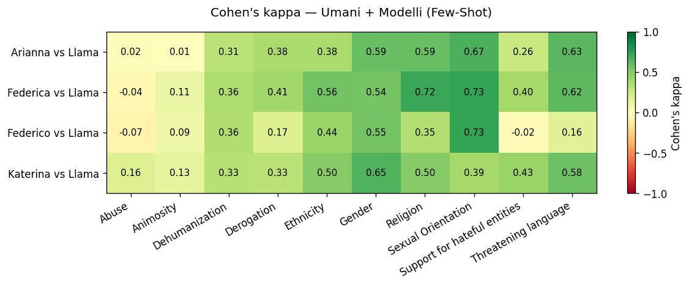

# Cohen's Kappa

## Solo Annotatori Umani

**Arianna vs Federica**

| categoria                    |   cohens_kappa |
|:-----------------------------|---------------:|
| Ethnicity                    |         0.66   |
| Gender                       |         0.777  |
| Religion                     |         0.717  |
| Sexual Orientation           |         0.8404 |
| Animosity                    |         0.1927 |
| Derogation                   |         0.4318 |
| Dehumanization               |         0.5506 |
| Threatening language         |         0.5923 |
| Support for hateful entities |         0.4588 |
| Abuse                        |        -0.0504 |
| OVERALL                      |         0.517  |

**Arianna vs Katerina**

| categoria                    |   cohens_kappa |
|:-----------------------------|---------------:|
| Ethnicity                    |         0.6    |
| Gender                       |         0.7647 |
| Religion                     |         0.6795 |
| Sexual Orientation           |         0.3939 |
| Animosity                    |        -0.0364 |
| Derogation                   |         0.405  |
| Dehumanization               |         0.7332 |
| Threatening language         |         0.6523 |
| Support for hateful entities |         0.37   |
| Abuse                        |        -0.0504 |
| OVERALL                      |         0.4512 |

**Arianna vs Federico**

| categoria                    |   cohens_kappa |
|:-----------------------------|---------------:|
| Ethnicity                    |         0.5    |
| Gender                       |         0.7177 |
| Religion                     |         0.5    |
| Sexual Orientation           |         0.4595 |
| Animosity                    |        -0.072  |
| Derogation                   |         0.2327 |
| Dehumanization               |         0.6401 |
| Threatening language         |         0.2606 |
| Support for hateful entities |        -0.0194 |
| Abuse                        |         0.0338 |
| OVERALL                      |         0.3253 |

**Federica vs Katerina**

| categoria                    |   cohens_kappa |
|:-----------------------------|---------------:|
| Ethnicity                    |         0.6542 |
| Gender                       |         0.8513 |
| Religion                     |         0.4223 |
| Sexual Orientation           |         0.5042 |
| Animosity                    |         0.2523 |
| Derogation                   |         0.5433 |
| Dehumanization               |         0.5924 |
| Threatening language         |         0.6367 |
| Support for hateful entities |         0.7861 |
| Abuse                        |         0.6564 |
| OVERALL                      |         0.5899 |

**Federica vs Federico**

| categoria                    |   cohens_kappa |
|:-----------------------------|---------------:|
| Ethnicity                    |         0.5917 |
| Gender                       |         0.8095 |
| Religion                     |         0.375  |
| Sexual Orientation           |         0.6811 |
| Animosity                    |        -0.0127 |
| Derogation                   |         0.1935 |
| Dehumanization               |         0.6173 |
| Threatening language         |        -0.0075 |
| Support for hateful entities |        -0.0195 |
| Abuse                        |        -0.0417 |
| OVERALL                      |         0.3187 |

**Katerina vs Federico**

| categoria                    |   cohens_kappa |
|:-----------------------------|---------------:|
| Ethnicity                    |         0.58   |
| Gender                       |         0.879  |
| Religion                     |         0.646  |
| Sexual Orientation           |         0.5798 |
| Animosity                    |        -0.0167 |
| Derogation                   |         0.2068 |
| Dehumanization               |         0.6271 |
| Threatening language         |         0.2105 |
| Support for hateful entities |        -0.0193 |
| Abuse                        |        -0.0417 |
| OVERALL                      |         0.3652 |

## Umani e Modelli Zero-Shot

### Kappa Medio per Modello
| modello   |   Kappa Medio |
|:----------|--------------:|
| Llama     |        0.3193 |
| **Mistral**   |        **0.3237** |
| Qwen      |        0.3046 |

### Dettaglio per Coppie
**Arianna vs Llama**

| categoria                    |   cohens_kappa |
|:-----------------------------|---------------:|
| Ethnicity                    |         0.4    |
| Gender                       |         0.6308 |
| Religion                     |         0.4608 |
| Sexual Orientation           |         0.5283 |
| Abuse                        |         0.0252 |
| Derogation                   |         0.3394 |
| Animosity                    |         0.0271 |
| Threatening language         |         0.5341 |
| Support for hateful entities |         0.0236 |
| Dehumanization               |         0.356  |
| OVERALL                      |         0.3325 |

**Federica vs Llama**

| categoria                    |   cohens_kappa |
|:-----------------------------|---------------:|
| Ethnicity                    |         0.5048 |
| Gender                       |         0.6418 |
| Religion                     |         0.4435 |
| Sexual Orientation           |         0.4982 |
| Abuse                        |         0.0193 |
| Derogation                   |         0.2321 |
| Animosity                    |         0.0435 |
| Threatening language         |         0.5781 |
| Support for hateful entities |         0.3539 |
| Dehumanization               |         0.466  |
| OVERALL                      |         0.3781 |

**Katerina vs Llama**

| categoria                    |   cohens_kappa |
|:-----------------------------|---------------:|
| Ethnicity                    |         0.3874 |
| Gender                       |         0.6923 |
| Religion                     |         0.3399 |
| Sexual Orientation           |         0.2891 |
| Abuse                        |         0.0193 |
| Derogation                   |         0.1829 |
| Animosity                    |         0.0086 |
| Threatening language         |         0.6367 |
| Support for hateful entities |         0.3687 |
| Dehumanization               |         0.239  |
| OVERALL                      |         0.3164 |

**Federico vs Llama**

| categoria                    |   cohens_kappa |
|:-----------------------------|---------------:|
| Ethnicity                    |         0.3361 |
| Gender                       |         0.5938 |
| Religion                     |         0.4012 |
| Sexual Orientation           |         0.4541 |
| Abuse                        |         0.0121 |
| Derogation                   |         0.1443 |
| Animosity                    |         0.0196 |
| Threatening language         |         0.2164 |
| Support for hateful entities |        -0.0183 |
| Dehumanization               |         0.3442 |
| OVERALL                      |         0.2503 |

**Arianna vs Mistral**

| categoria                    |   cohens_kappa |
|:-----------------------------|---------------:|
| Ethnicity                    |         0.38   |
| Gender                       |         0.6308 |
| Religion                     |         0.5213 |
| Sexual Orientation           |         0.6277 |
| Abuse                        |         0.0143 |
| Derogation                   |         0.0895 |
| Animosity                    |        -0.025  |
| Threatening language         |         0.5704 |
| Support for hateful entities |         0.2725 |
| Dehumanization               |         0.1136 |
| OVERALL                      |         0.3195 |

**Federica vs Mistral**

| categoria                    |   cohens_kappa |
|:-----------------------------|---------------:|
| Ethnicity                    |         0.488  |
| Gender                       |         0.6418 |
| Religion                     |         0.6807 |
| Sexual Orientation           |         0.7957 |
| Abuse                        |         0.0033 |
| Derogation                   |         0.0719 |
| Animosity                    |         0.0147 |
| Threatening language         |         0.5642 |
| Support for hateful entities |         0.6275 |
| Dehumanization               |         0.2736 |
| OVERALL                      |         0.4161 |

**Katerina vs Mistral**

| categoria                    |   cohens_kappa |
|:-----------------------------|---------------:|
| Ethnicity                    |         0.3848 |
| Gender                       |         0.6923 |
| Religion                     |         0.3925 |
| Sexual Orientation           |         0.5042 |
| Abuse                        |         0.0033 |
| Derogation                   |         0.0686 |
| Animosity                    |         0.0483 |
| Threatening language         |         0.4724 |
| Support for hateful entities |         0.5181 |
| Dehumanization               |         0.1102 |
| OVERALL                      |         0.3195 |

**Federico vs Mistral**

| categoria                    |   cohens_kappa |
|:-----------------------------|---------------:|
| Ethnicity                    |         0.3752 |
| Gender                       |         0.5938 |
| Religion                     |         0.4631 |
| Sexual Orientation           |         0.6811 |
| Abuse                        |        -0.0156 |
| Derogation                   |         0.0375 |
| Animosity                    |         0.0044 |
| Threatening language         |         0.0789 |
| Support for hateful entities |        -0.0197 |
| Dehumanization               |         0.199  |
| OVERALL                      |         0.2398 |

**Arianna vs Qwen**

| categoria                    |   cohens_kappa |
|:-----------------------------|---------------:|
| Ethnicity                    |         0.38   |
| Gender                       |         0.6308 |
| Religion                     |         0.5556 |
| Sexual Orientation           |         0.3243 |
| Abuse                        |        -0.0504 |
| Derogation                   |         0.2176 |
| Animosity                    |        -0.0834 |
| Threatening language         |         0.378  |
| Support for hateful entities |         0.2905 |
| Dehumanization               |         0.2723 |
| OVERALL                      |         0.2915 |

**Federica vs Qwen**

| categoria                    |   cohens_kappa |
|:-----------------------------|---------------:|
| Ethnicity                    |         0.4806 |
| Gender                       |         0.5821 |
| Religion                     |         0.717  |
| Sexual Orientation           |         0.426  |
| Abuse                        |        -0.0309 |
| Derogation                   |         0.2857 |
| Animosity                    |        -0.2723 |
| Threatening language         |         0.3426 |
| Support for hateful entities |         0.451  |
| Dehumanization               |         0.3466 |
| OVERALL                      |         0.3328 |

**Katerina vs Qwen**

| categoria                    |   cohens_kappa |
|:-----------------------------|---------------:|
| Ethnicity                    |         0.4232 |
| Gender                       |         0.6308 |
| Religion                     |         0.4231 |
| Sexual Orientation           |         0.3697 |
| Abuse                        |         0.3127 |
| Derogation                   |         0.2691 |
| Animosity                    |        -0.0812 |
| Threatening language         |         0.6167 |
| Support for hateful entities |         0.481  |
| Dehumanization               |         0.2963 |
| OVERALL                      |         0.3741 |

**Federico vs Qwen**

| categoria                    |   cohens_kappa |
|:-----------------------------|---------------:|
| Ethnicity                    |         0.3643 |
| Gender                       |         0.5312 |
| Religion                     |         0.5    |
| Sexual Orientation           |         0.2908 |
| Abuse                        |        -0.0417 |
| Derogation                   |         0.1292 |
| Animosity                    |         0.0799 |
| Threatening language         |         0.0957 |
| Support for hateful entities |        -0.0181 |
| Dehumanization               |         0.2672 |
| OVERALL                      |         0.2198 |

## Umani e Modelli Few-Shot

### Kappa Medio per Modello
| modello   |   Kappa Medio |
|:----------|--------------:|
| Llama     |        0.3311 |
| **Mistral**   |        **0.3895** |
| Qwen      |        0.3307 |

### Dettaglio per Coppie
**Arianna vs Llama**

| categoria                    |   cohens_kappa |
|:-----------------------------|---------------:|
| Ethnicity                    |         0.34   |
| Gender                       |         0.6084 |
| Religion                     |         0.3333 |
| Sexual Orientation           |         0.6667 |
| Abuse                        |         0.053  |
| Derogation                   |         0.2092 |
| Animosity                    |         0.0189 |
| Threatening language         |         0.5742 |
| Support for hateful entities |         0.1667 |
| Dehumanization               |         0.3858 |
| OVERALL                      |         0.3356 |

**Federica vs Llama**

| categoria                    |   cohens_kappa |
|:-----------------------------|---------------:|
| Ethnicity                    |         0.5573 |
| Gender                       |         0.6194 |
| Religion                     |         0.5283 |
| Sexual Orientation           |         0.6277 |
| Abuse                        |        -0.0504 |
| Derogation                   |         0.2697 |
| Animosity                    |        -0.0511 |
| Threatening language         |         0.6727 |
| Support for hateful entities |         0.4014 |
| Dehumanization               |         0.3883 |
| OVERALL                      |         0.3963 |

**Katerina vs Llama**

| categoria                    |   cohens_kappa |
|:-----------------------------|---------------:|
| Ethnicity                    |         0.4856 |
| Gender                       |         0.6687 |
| Religion                     |         0.1667 |
| Sexual Orientation           |         0.2424 |
| Abuse                        |         0.0896 |
| Derogation                   |         0.2259 |
| Animosity                    |         0.1549 |
| Threatening language         |         0.6799 |
| Support for hateful entities |         0.3443 |
| Dehumanization               |         0.323  |
| OVERALL                      |         0.3381 |

**Federico vs Llama**

| categoria                    |   cohens_kappa |
|:-----------------------------|---------------:|
| Ethnicity                    |         0.4203 |
| Gender                       |         0.5721 |
| Religion                     |         0.2143 |
| Sexual Orientation           |         0.5946 |
| Abuse                        |         0.0338 |
| Derogation                   |         0.184  |
| Animosity                    |         0.0602 |
| Threatening language         |         0.0823 |
| Support for hateful entities |        -0.0185 |
| Dehumanization               |         0.3987 |
| OVERALL                      |         0.2542 |

**Arianna vs Mistral**

| categoria                    |   cohens_kappa |
|:-----------------------------|---------------:|
| Ethnicity                    |         0.52   |
| Gender                       |         0.6541 |
| Religion                     |         0.7093 |
| Sexual Orientation           |         0.6667 |
| Abuse                        |        -0.011  |
| Derogation                   |         0.2101 |
| Animosity                    |        -0.0442 |
| Threatening language         |         0.51   |
| Support for hateful entities |         0.3043 |
| Dehumanization               |         0.3714 |
| OVERALL                      |         0.3891 |

**Federica vs Mistral**

| categoria                    |   cohens_kappa |
|:-----------------------------|---------------:|
| Ethnicity                    |         0.6964 |
| Gender                       |         0.665  |
| Religion                     |         0.6582 |
| Sexual Orientation           |         0.8404 |
| Abuse                        |         0.0388 |
| Derogation                   |         0.2535 |
| Animosity                    |        -0.0976 |
| Threatening language         |         0.6014 |
| Support for hateful entities |         0.5616 |
| Dehumanization               |         0.5133 |
| OVERALL                      |         0.4731 |

**Katerina vs Mistral**

| categoria                    |   cohens_kappa |
|:-----------------------------|---------------:|
| Ethnicity                    |         0.661  |
| Gender                       |         0.717  |
| Religion                     |         0.4573 |
| Sexual Orientation           |         0.5455 |
| Abuse                        |         0.0056 |
| Derogation                   |         0.2411 |
| Animosity                    |        -0.0552 |
| Threatening language         |         0.5057 |
| Support for hateful entities |         0.5588 |
| Dehumanization               |         0.4059 |
| OVERALL                      |         0.4043 |

**Federico vs Mistral**

| categoria                    |   cohens_kappa |
|:-----------------------------|---------------:|
| Ethnicity                    |         0.5494 |
| Gender                       |         0.6164 |
| Religion                     |         0.3893 |
| Sexual Orientation           |         0.7297 |
| Abuse                        |         0.0449 |
| Derogation                   |         0.083  |
| Animosity                    |         0.0033 |
| Threatening language         |         0.0934 |
| Support for hateful entities |        -0.0196 |
| Dehumanization               |         0.4256 |
| OVERALL                      |         0.2915 |

**Arianna vs Qwen**

| categoria                    |   cohens_kappa |
|:-----------------------------|---------------:|
| Ethnicity                    |         0.52   |
| Gender                       |         0.7026 |
| Religion                     |         0.4231 |
| Sexual Orientation           |         0.3939 |
| Abuse                        |        -0.0188 |
| Derogation                   |         0.2979 |
| Animosity                    |        -0.1243 |
| Threatening language         |         0.497  |
| Support for hateful entities |         0.1667 |
| Dehumanization               |         0.2915 |
| OVERALL                      |         0.315  |

**Federica vs Qwen**

| categoria                    |   cohens_kappa |
|:-----------------------------|---------------:|
| Ethnicity                    |         0.583  |
| Gender                       |         0.5748 |
| Religion                     |         0.5273 |
| Sexual Orientation           |         0.5042 |
| Abuse                        |        -0.0152 |
| Derogation                   |         0.3043 |
| Animosity                    |         0.0691 |
| Threatening language         |         0.5399 |
| Support for hateful entities |         0.4718 |
| Dehumanization               |         0.2169 |
| OVERALL                      |         0.3776 |

**Katerina vs Qwen**

| categoria                    |   cohens_kappa |
|:-----------------------------|---------------:|
| Ethnicity                    |         0.4969 |
| Gender                       |         0.6283 |
| Religion                     |         0.3856 |
| Sexual Orientation           |         0.4792 |
| Abuse                        |        -0.0152 |
| Derogation                   |         0.4105 |
| Animosity                    |         0.1504 |
| Threatening language         |         0.6622 |
| Support for hateful entities |         0.4262 |
| Dehumanization               |         0.3268 |
| OVERALL                      |         0.3951 |

**Federico vs Qwen**

| categoria                    |   cohens_kappa |
|:-----------------------------|---------------:|
| Ethnicity                    |         0.4812 |
| Gender                       |         0.5808 |
| Religion                     |         0.469  |
| Sexual Orientation           |         0.3697 |
| Abuse                        |        -0.0174 |
| Derogation                   |         0.0826 |
| Animosity                    |         0.0223 |
| Threatening language         |         0.0769 |
| Support for hateful entities |        -0.0185 |
| Dehumanization               |         0.3045 |
| OVERALL                      |         0.2351 |

