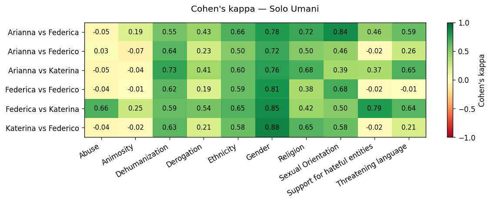
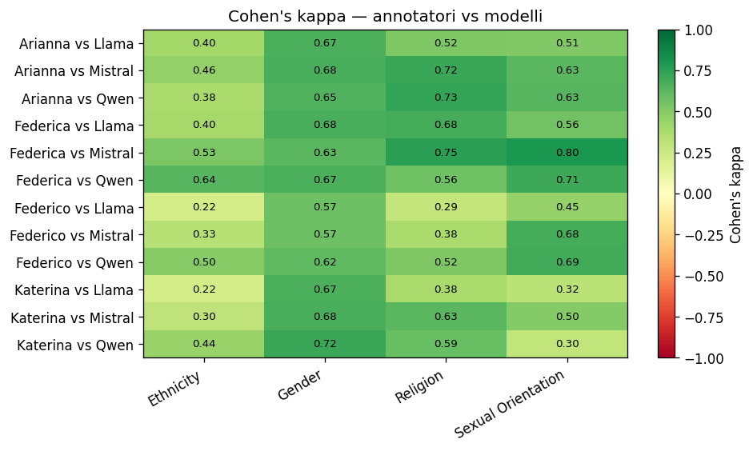
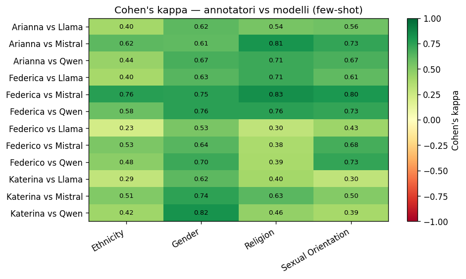

# Cohen's kappa

## Annotatori

**Arianna vs Federica**

| categoria          |   cohens_kappa_zero_shot |
|:-------------------|-------------------------:|
| Ethnicity          |                   0.66   |
| Gender             |                   0.777  |
| Religion           |                   0.717  |
| Sexual Orientation |                   0.8404 |
| OVERALL            |                   0.7486 |

**Arianna vs Katerina**

| categoria          |   cohens_kappa_zero_shot |
|:-------------------|-------------------------:|
| Ethnicity          |                   0.6    |
| Gender             |                   0.7647 |
| Religion           |                   0.6795 |
| Sexual Orientation |                   0.3939 |
| OVERALL            |                   0.6095 |

**Arianna vs Federico**

| categoria          |   cohens_kappa_zero_shot |
|:-------------------|-------------------------:|
| Ethnicity          |                   0.5    |
| Gender             |                   0.7177 |
| Religion           |                   0.5    |
| Sexual Orientation |                   0.4595 |
| OVERALL            |                   0.5443 |

**Federica vs Katerina**

| categoria          |   cohens_kappa_zero_shot |
|:-------------------|-------------------------:|
| Ethnicity          |                   0.6542 |
| Gender             |                   0.8513 |
| Religion           |                   0.4223 |
| Sexual Orientation |                   0.5042 |
| OVERALL            |                   0.608  |

**Federica vs Federico**

| categoria          |   cohens_kappa_zero_shot |
|:-------------------|-------------------------:|
| Ethnicity          |                   0.5917 |
| Gender             |                   0.8095 |
| Religion           |                   0.375  |
| Sexual Orientation |                   0.6811 |
| OVERALL            |                   0.6143 |

**Katerina vs Federico**

| categoria          |   cohens_kappa_zero_shot |
|:-------------------|-------------------------:|
| Ethnicity          |                   0.58   |
| Gender             |                   0.879  |
| Religion           |                   0.646  |
| Sexual Orientation |                   0.5798 |
| OVERALL            |                   0.6712 |

## Modelli

**Arianna vs Llama**

| categoria          |   cohens_kappa_zero_shot |   cohens_kappa_few_shot |
|:-------------------|-------------------------:|------------------------:|
| Ethnicity          |                   0.4    |                  0.4    |
| Gender             |                   0.6687 |                  0.6243 |
| Religion           |                   0.5205 |                  0.5423 |
| Sexual Orientation |                   0.5082 |                  0.5635 |
| OVERALL            |                   0.5244 |                  0.5325 |

**Federica vs Llama**

| categoria          |   cohens_kappa_zero_shot |   cohens_kappa_few_shot |
|:-------------------|-------------------------:|------------------------:|
| Ethnicity          |                   0.3959 |                  0.3974 |
| Gender             |                   0.678  |                  0.6336 |
| Religion           |                   0.6803 |                  0.7055 |
| Sexual Orientation |                   0.5607 |                  0.6127 |
| OVERALL            |                   0.5787 |                  0.5873 |

**Katerina vs Llama**

| categoria          |   cohens_kappa_zero_shot |   cohens_kappa_few_shot |
|:-------------------|-------------------------:|------------------------:|
| Ethnicity          |                   0.2165 |                  0.2948 |
| Gender             |                   0.6687 |                  0.6243 |
| Religion           |                   0.3849 |                  0.4025 |
| Sexual Orientation |                   0.3191 |                  0.3017 |
| OVERALL            |                   0.3973 |                  0.4058 |

**Federico vs Llama**

| categoria          |   cohens_kappa_zero_shot |   cohens_kappa_few_shot |
|:-------------------|-------------------------:|------------------------:|
| Ethnicity          |                   0.2171 |                  0.2263 |
| Gender             |                   0.5721 |                  0.5316 |
| Religion           |                   0.2857 |                  0.2996 |
| Sexual Orientation |                   0.4505 |                  0.4278 |
| OVERALL            |                   0.3813 |                  0.3713 |

**Arianna vs Mistral**

| categoria          |   cohens_kappa_zero_shot |   cohens_kappa_few_shot |
|:-------------------|-------------------------:|------------------------:|
| Ethnicity          |                   0.46   |                  0.62   |
| Gender             |                   0.6785 |                  0.6141 |
| Religion           |                   0.717  |                  0.8113 |
| Sexual Orientation |                   0.6277 |                  0.734  |
| OVERALL            |                   0.6208 |                  0.6948 |

**Federica vs Mistral**

| categoria          |   cohens_kappa_zero_shot |   cohens_kappa_few_shot |
|:-------------------|-------------------------:|------------------------:|
| Ethnicity          |                   0.5263 |                  0.7609 |
| Gender             |                   0.6271 |                  0.7514 |
| Religion           |                   0.7508 |                  0.8339 |
| Sexual Orientation |                   0.7957 |                  0.7957 |
| OVERALL            |                   0.675  |                  0.7855 |

**Katerina vs Mistral**

| categoria          |   cohens_kappa_zero_shot |   cohens_kappa_few_shot |
|:-------------------|-------------------------:|------------------------:|
| Ethnicity          |                   0.3029 |                  0.5083 |
| Gender             |                   0.6785 |                  0.7428 |
| Religion           |                   0.6324 |                  0.6324 |
| Sexual Orientation |                   0.5042 |                  0.5042 |
| OVERALL            |                   0.5295 |                  0.5969 |

**Federico vs Mistral**

| categoria          |   cohens_kappa_zero_shot |   cohens_kappa_few_shot |
|:-------------------|-------------------------:|------------------------:|
| Ethnicity          |                   0.3301 |                  0.5296 |
| Gender             |                   0.5746 |                  0.6401 |
| Religion           |                   0.375  |                  0.375  |
| Sexual Orientation |                   0.6811 |                  0.6811 |
| OVERALL            |                   0.4902 |                  0.5564 |

**Arianna vs Qwen**

| categoria          |   cohens_kappa_zero_shot |   cohens_kappa_few_shot |
|:-------------------|-------------------------:|------------------------:|
| Ethnicity          |                   0.38   |                  0.44   |
| Gender             |                   0.6541 |                  0.6739 |
| Religion           |                   0.7297 |                  0.7093 |
| Sexual Orientation |                   0.6341 |                  0.6667 |
| OVERALL            |                   0.5995 |                  0.6225 |

**Federica vs Qwen**

| categoria          |   cohens_kappa_zero_shot |   cohens_kappa_few_shot |
|:-------------------|-------------------------:|------------------------:|
| Ethnicity          |                   0.637  |                  0.583  |
| Gender             |                   0.665  |                  0.7576 |
| Religion           |                   0.5633 |                  0.7559 |
| Sexual Orientation |                   0.71   |                  0.734  |
| OVERALL            |                   0.6438 |                  0.7076 |

**Katerina vs Qwen**

| categoria          |   cohens_kappa_zero_shot |   cohens_kappa_few_shot |
|:-------------------|-------------------------:|------------------------:|
| Ethnicity          |                   0.438  |                  0.4195 |
| Gender             |                   0.717  |                  0.8188 |
| Religion           |                   0.5888 |                  0.4573 |
| Sexual Orientation |                   0.2958 |                  0.3939 |
| OVERALL            |                   0.5099 |                  0.5224 |

**Federico vs Qwen**

| categoria          |   cohens_kappa_zero_shot |   cohens_kappa_few_shot |
|:-------------------|-------------------------:|------------------------:|
| Ethnicity          |                   0.496  |                  0.4812 |
| Gender             |                   0.6164 |                  0.7033 |
| Religion           |                   0.5192 |                  0.3893 |
| Sexual Orientation |                   0.6933 |                  0.7297 |
| OVERALL            |                   0.5812 |                  0.5759 |

## Kappa medio per modello

| modello   |   cohens_kappa_medio_zero_shot |   cohens_kappa_medio_few_shot |
|:----------|-------------------------------:|------------------------------:|
| Mistral   |                         0.5789 |                        0.6584 |
| Qwen      |                         0.5836 |                        0.6071 |
| Llama     |                         0.4704 |                        0.4742 |

