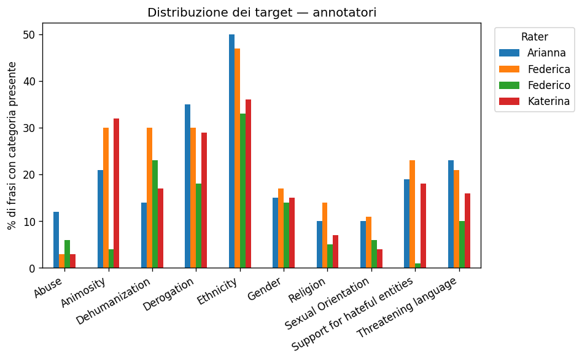
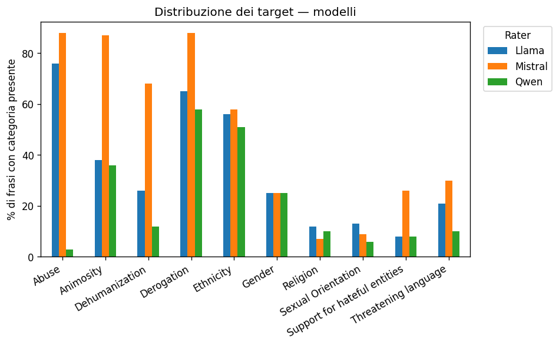
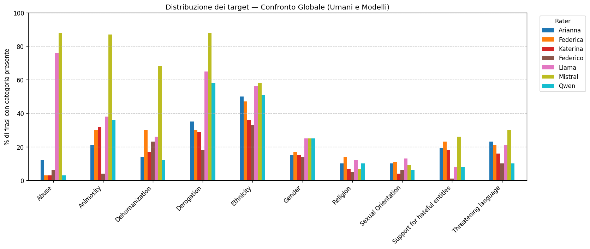

# Distribuzione di tutte le componenti nei 100 esempi

## Annotatori
 
| categoria                    |   Arianna |   Federica |   Federico |   Katerina |
|:-----------------------------|----------:|-----------:|-----------:|-----------:|
| Abuse                        |        12 |          3 |          6 |          3 |
| Animosity                    |        21 |         30 |          4 |         32 |
| Dehumanization               |        14 |         30 |         23 |         17 |
| Derogation                   |        35 |         30 |         18 |         29 |
| Ethnicity                    |        50 |         47 |         33 |         36 |
| Gender                       |        15 |         17 |         14 |         15 |
| Religion                     |        10 |         14 |          5 |          7 |
| Sexual Orientation           |        10 |         11 |          6 |          4 |
| Support for hateful entities |        19 |         23 |          1 |         18 |
| Threatening language         |        23 |         21 |         10 |         16 |

## Modelli
 
| categoria                    |   Llama |   Mistral |   Qwen |
|:-----------------------------|--------:|----------:|-------:|
| Abuse                        |      76 |        88 |      3 |
| Animosity                    |      38 |        87 |     36 |
| Dehumanization               |      26 |        68 |     12 |
| Derogation                   |      65 |        88 |     58 |
| Ethnicity                    |      56 |        58 |     51 |
| Gender                       |      25 |        25 |     25 |
| Religion                     |      12 |         7 |     10 |
| Sexual Orientation           |      13 |         9 |      6 |
| Support for hateful entities |       8 |        26 |      8 |
| Threatening language         |      21 |        30 |     10 |
 

