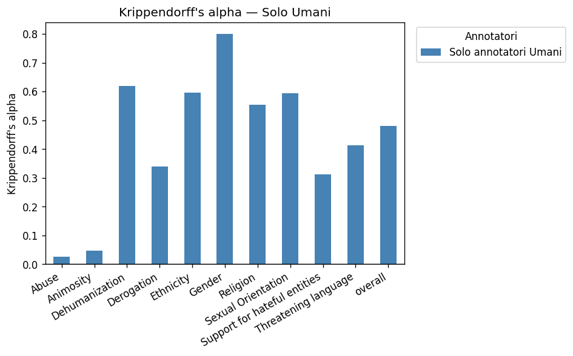
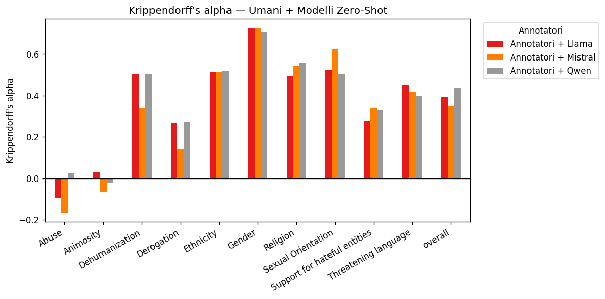
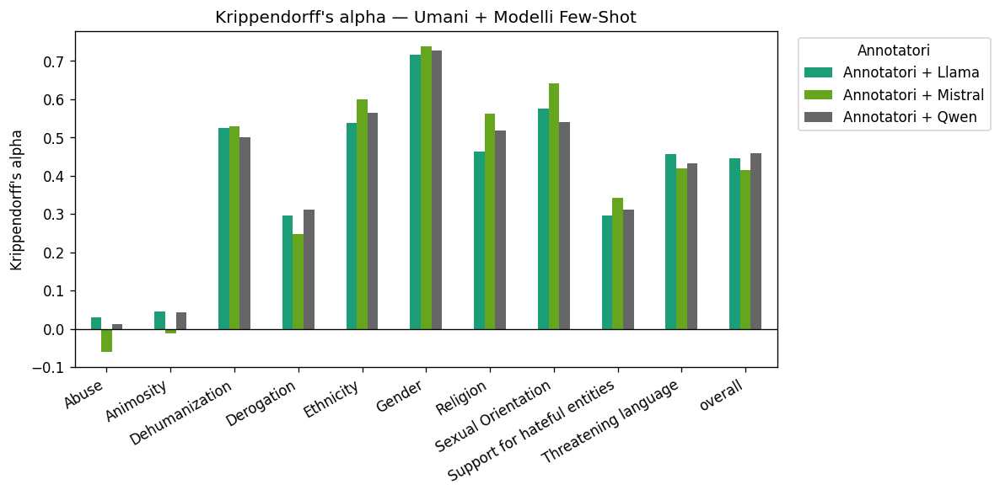

# Krippendorff's Alpha

## Solo Annotatori Umani

| categoria                    |              Solo Umani |
|:-----------------------------|------------------------:|
| Abuse                        |                  0.0273 |
| Animosity                    |                  0.0476 |
| Dehumanization               |                  0.6192 |
| Derogation                   |                  0.3403 |
| Ethnicity                    |                  0.596  |
| Gender                       |                  0.8006 |
| Religion                     |                  0.5534 |
| Sexual Orientation           |                  0.5931 |
| Support for hateful entities |                  0.3118 |
| Threatening language         |                  0.4127 |
| OVERALL                      |                  0.4795 |

---
## Umani + Modelli Zero-Shot

| categoria                    |   Annotatori + Llama |   Annotatori + Mistral |   Annotatori + Qwen |
|:-----------------------------|---------------------:|-----------------------:|--------------------:|
| Abuse                        |              -0.0978 |                -0.1666 |              0.0232 |
| Animosity                    |               0.0309 |                -0.0648 |             -0.0221 |
| Dehumanization               |               0.5062 |                 0.3375 |              0.5022 |
| Derogation                   |               0.2668 |                 0.1406 |              0.2751 |
| Ethnicity                    |               0.5157 |                 0.5135 |              0.5206 |
| Gender                       |               0.7267 |                 0.7267 |              0.7057 |
| Religion                     |               0.4919 |                 0.543  |              0.558  |
| Sexual Orientation           |               0.5248 |                 0.6239 |              0.5048 |
| Support for hateful entities |               0.2789 |                 0.3394 |              0.3288 |
| Threatening language         |               0.4503 |                 0.4165 |              0.3972 |
| OVERALL                      |               0.3947 |                 0.3467 |              0.4334 |

---
## Umani + Modelli Few-Shot

| categoria                    |   Annotatori + Llama |   Annotatori + Mistral |   Annotatori + Qwen |
|:-----------------------------|---------------------:|-----------------------:|--------------------:|
| Abuse                        |               0.0291 |                -0.0609 |              0.0125 |
| Animosity                    |               0.0457 |                -0.0127 |              0.0442 |
| Dehumanization               |               0.5241 |                 0.5293 |              0.5015 |
| Derogation                   |               0.2958 |                 0.2481 |              0.3113 |
| Ethnicity                    |               0.5377 |                 0.6004 |              0.5634 |
| Gender                       |               0.7153 |                 0.7383 |              0.7271 |
| Religion                     |               0.4624 |                 0.5613 |              0.5175 |
| Sexual Orientation           |               0.5757 |                 0.642  |              0.5401 |
| Support for hateful entities |               0.2955 |                 0.3413 |              0.3119 |
| Threatening language         |               0.4575 |                 0.4203 |              0.432  |
| OVERALL                      |               0.4457 |                 0.4149 |              0.4592 |

