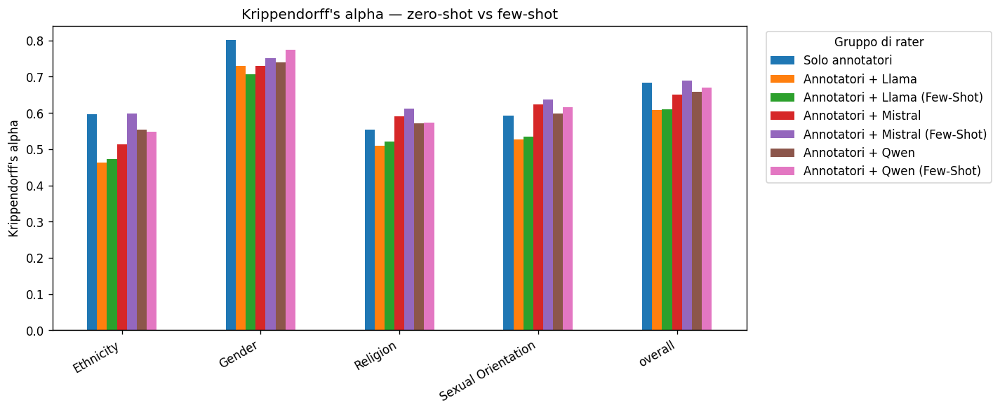

# Krippendorff's alpha

| categoria          |   Solo annotatori |   Annotatori + Llama |   Annotatori + Llama (Few-Shot) |   Annotatori + Mistral |   Annotatori + Mistral (Few-Shot) |   Annotatori + Qwen |   Annotatori + Qwen (Few-Shot) |
|:-------------------|------------------:|---------------------:|--------------------------------:|-----------------------:|----------------------------------:|--------------------:|-------------------------------:|
| Ethnicity          |            0.596  |               0.4638 |                          0.4722 |                 0.5128 |                            0.5986 |              0.5528 |                         0.5472 |
| Gender             |            0.8006 |               0.7292 |                          0.7067 |                 0.7287 |                            0.7501 |              0.7383 |                         0.7749 |
| Religion           |            0.5534 |               0.5086 |                          0.5205 |                 0.5897 |                            0.6119 |              0.572  |                         0.5735 |
| Sexual Orientation |            0.5931 |               0.5258 |                          0.5343 |                 0.6239 |                            0.6368 |              0.5976 |                         0.6155 |
| overall            |            0.6835 |               0.6073 |                          0.6099 |                 0.6506 |                            0.6894 |              0.6588 |                         0.6702 |

