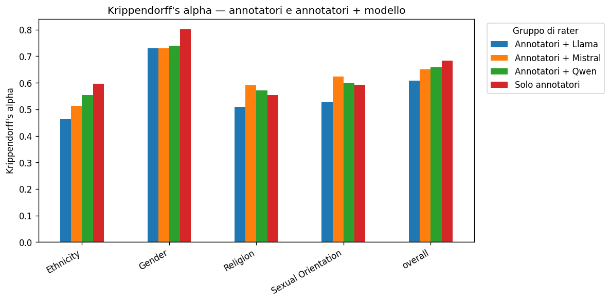

# Krippendorff's alpha solo target (presente/assente per i modelli)
 
| categoria          |   Annotatori + Llama |   Annotatori + Mistral |   Annotatori + Qwen |   Solo annotatori |
|:-------------------|---------------------:|-----------------------:|--------------------:|------------------:|
| Ethnicity          |               0.4638 |                 0.5128 |              0.5528 |            0.596  |
| Gender             |               0.7292 |                 0.7287 |              0.7383 |            0.8006 |
| Religion           |               0.5086 |                 0.5897 |              0.572  |            0.5534 |
| Sexual Orientation |               0.5258 |                 0.6239 |              0.5976 |            0.5931 |
| OVERALL            |               0.6073 |                 0.6506 |              0.6588 |            0.6835 |
 

