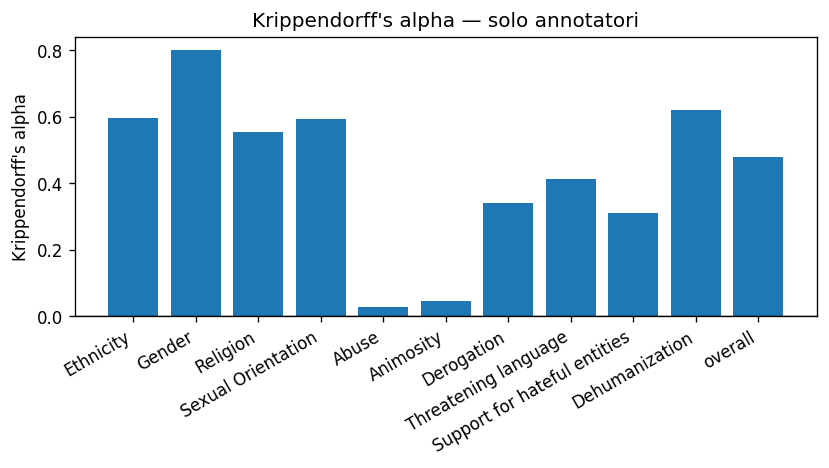
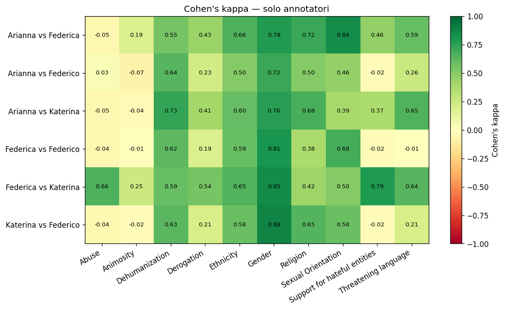
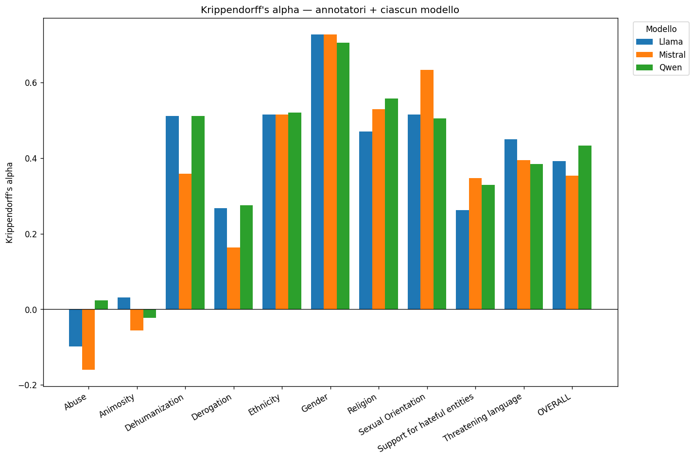

# Report agreement con krippendoff alpha e cohen's kappa per span labelling

## Krippendorff's alpha — solo annotatori
 
| categoria                    |   krippendorff_alpha |
|:-----------------------------|---------------------:|
| Ethnicity                    |               0.596  |
| Gender                       |               0.8006 |
| Religion                     |               0.5534 |
| Sexual Orientation           |               0.5931 |
| Abuse                        |               0.0273 |
| Animosity                    |               0.0476 |
| Derogation                   |               0.3403 |
| Threatening language         |               0.4127 |
| Support for hateful entities |               0.3118 |
| Dehumanization               |               0.6192 |
| overall                      |               0.4795 |
 

## Cohen's kappa — solo annotatori
 
| categoria                    | rater_1   | rater_2   |   cohens_kappa |
|:-----------------------------|:----------|:----------|---------------:|
| Ethnicity                    | Arianna   | Federica  |         0.66   |
| Ethnicity                    | Arianna   | Katerina  |         0.6    |
| Ethnicity                    | Arianna   | Federico  |         0.5    |
| Ethnicity                    | Federica  | Katerina  |         0.6542 |
| Ethnicity                    | Federica  | Federico  |         0.5917 |
| Ethnicity                    | Katerina  | Federico  |         0.58   |
| Gender                       | Arianna   | Federica  |         0.777  |
| Gender                       | Arianna   | Katerina  |         0.7647 |
| Gender                       | Arianna   | Federico  |         0.7177 |
| Gender                       | Federica  | Katerina  |         0.8513 |
| Gender                       | Federica  | Federico  |         0.8095 |
| Gender                       | Katerina  | Federico  |         0.879  |
| Religion                     | Arianna   | Federica  |         0.717  |
| Religion                     | Arianna   | Katerina  |         0.6795 |
| Religion                     | Arianna   | Federico  |         0.5    |
| Religion                     | Federica  | Katerina  |         0.4223 |
| Religion                     | Federica  | Federico  |         0.375  |
| Religion                     | Katerina  | Federico  |         0.646  |
| Sexual Orientation           | Arianna   | Federica  |         0.8404 |
| Sexual Orientation           | Arianna   | Katerina  |         0.3939 |
| Sexual Orientation           | Arianna   | Federico  |         0.4595 |
| Sexual Orientation           | Federica  | Katerina  |         0.5042 |
| Sexual Orientation           | Federica  | Federico  |         0.6811 |
| Sexual Orientation           | Katerina  | Federico  |         0.5798 |
| Abuse                        | Arianna   | Federica  |        -0.0504 |
| Abuse                        | Arianna   | Katerina  |        -0.0504 |
| Abuse                        | Arianna   | Federico  |         0.0338 |
| Abuse                        | Federica  | Katerina  |         0.6564 |
| Abuse                        | Federica  | Federico  |        -0.0417 |
| Abuse                        | Katerina  | Federico  |        -0.0417 |
| Animosity                    | Arianna   | Federica  |         0.1927 |
| Animosity                    | Arianna   | Katerina  |        -0.0364 |
| Animosity                    | Arianna   | Federico  |        -0.072  |
| Animosity                    | Federica  | Katerina  |         0.2523 |
| Animosity                    | Federica  | Federico  |        -0.0127 |
| Animosity                    | Katerina  | Federico  |        -0.0167 |
| Derogation                   | Arianna   | Federica  |         0.4318 |
| Derogation                   | Arianna   | Katerina  |         0.405  |
| Derogation                   | Arianna   | Federico  |         0.2327 |
| Derogation                   | Federica  | Katerina  |         0.5433 |
| Derogation                   | Federica  | Federico  |         0.1935 |
| Derogation                   | Katerina  | Federico  |         0.2068 |
| Threatening language         | Arianna   | Federica  |         0.5923 |
| Threatening language         | Arianna   | Katerina  |         0.6523 |
| Threatening language         | Arianna   | Federico  |         0.2606 |
| Threatening language         | Federica  | Katerina  |         0.6367 |
| Threatening language         | Federica  | Federico  |        -0.0075 |
| Threatening language         | Katerina  | Federico  |         0.2105 |
| Support for hateful entities | Arianna   | Federica  |         0.4588 |
| Support for hateful entities | Arianna   | Katerina  |         0.37   |
| Support for hateful entities | Arianna   | Federico  |        -0.0194 |
| Support for hateful entities | Federica  | Katerina  |         0.7861 |
| Support for hateful entities | Federica  | Federico  |        -0.0195 |
| Support for hateful entities | Katerina  | Federico  |        -0.0193 |
| Dehumanization               | Arianna   | Federica  |         0.5506 |
| Dehumanization               | Arianna   | Katerina  |         0.7332 |
| Dehumanization               | Arianna   | Federico  |         0.6401 |
| Dehumanization               | Federica  | Katerina  |         0.5924 |
| Dehumanization               | Federica  | Federico  |         0.6173 |
| Dehumanization               | Katerina  | Federico  |         0.6271 |
 

## Krippendorff's alpha — annotatori + ciascun modello
 
| Categoria                    |   Llama |   Mistral |   Qwen |
|:-----------------------------|--------:|----------:|-------:|
| Abuse                        |  -0.098 |    -0.16  |  0.023 |
| Animosity                    |   0.031 |    -0.056 | -0.022 |
| Dehumanization               |   0.511 |     0.359 |  0.511 |
| Derogation                   |   0.267 |     0.164 |  0.275 |
| Ethnicity                    |   0.515 |     0.516 |  0.521 |
| Gender                       |   0.727 |     0.727 |  0.706 |
| Religion                     |   0.471 |     0.53  |  0.558 |
| Sexual Orientation           |   0.515 |     0.634 |  0.505 |
| Support for hateful entities |   0.262 |     0.347 |  0.329 |
| Threatening language         |   0.45  |     0.395 |  0.384 |
| OVERALL                      |   0.392 |     0.353 |  0.433 |
 

