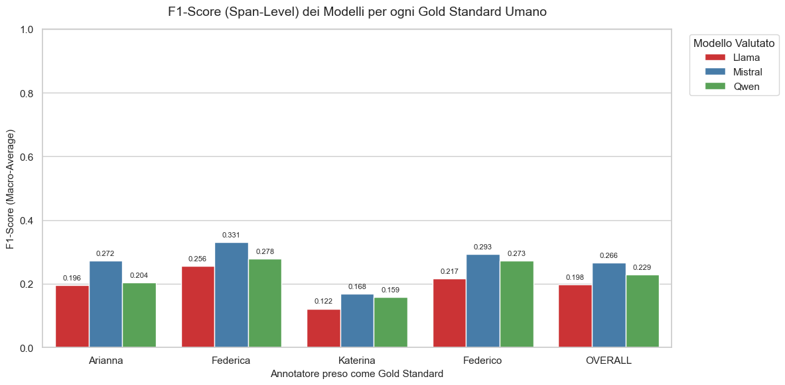

# F1-Score: Estrazione Span (Token-Level) in FewShot

Il seguente report valuta le prestazioni dei modelli nell'estrazione degli span esatti.
Ogni riga mostra i risultati ottenuti impostando un diverso annotatore umano come Gold Standard.
Calcolato dividendo prima il testo in tokens.
Poi per ogni token e per ogni categoria classificazione binaria: 1 se è stato annotato con quella categoria; 0 altrimenti.
Questo procedimento per ogni annotazione.

## Risultati Modelli

| Gold Standard (Umano)   |   Llama |   Mistral |   Qwen |
|:------------------------|--------:|----------:|-------:|
| Arianna                 |  0.196  |     0.272 | 0.204  |
| Federica                |  0.256  |     0.331 | 0.278  |
| Katerina                |  0.122  |     0.168 | 0.159  |
| Federico                |  0.217  |     0.293 | 0.273  |
| **OVERALL**                 |  **0.1978** |     **0.266** | **0.2285** |

