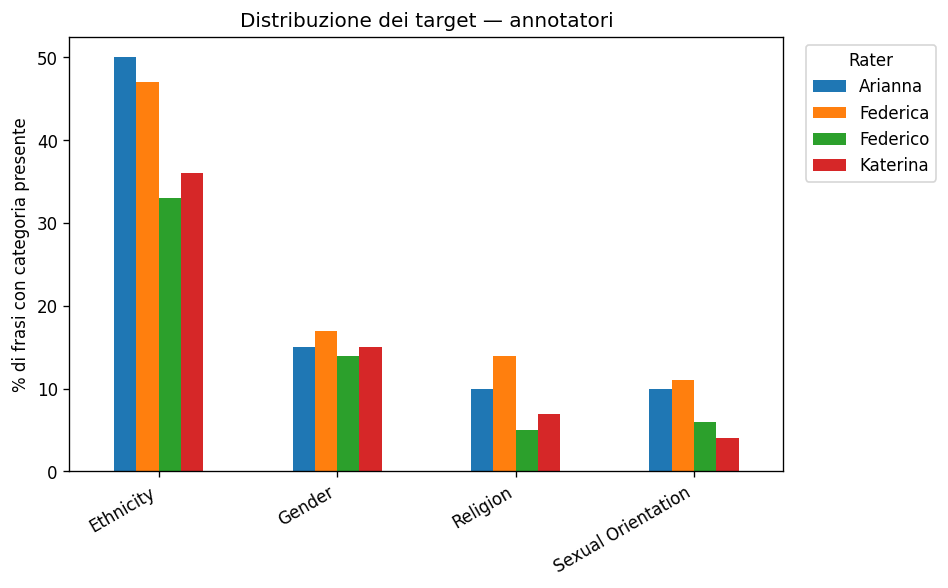
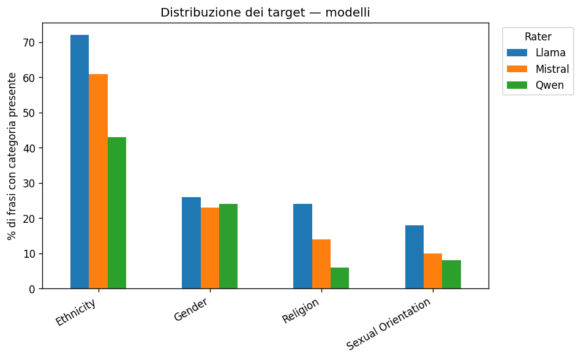

# Distribuzione dei target

## Annotatori
 
| categoria          |   Arianna |   Federica |   Federico |   Katerina |
|:-------------------|----------:|-----------:|-----------:|-----------:|
| Ethnicity          |        50 |         47 |         33 |         36 |
| Gender             |        15 |         17 |         14 |         15 |
| Religion           |        10 |         14 |          5 |          7 |
| Sexual Orientation |        10 |         11 |          6 |          4 |
 

## Modelli
 
| categoria          |   Llama |   Mistral |   Qwen |
|:-------------------|--------:|----------:|-------:|
| Ethnicity          |      72 |        61 |     43 |
| Gender             |      26 |        23 |     24 |
| Religion           |      24 |        14 |      6 |
| Sexual Orientation |      18 |        10 |      8 |
 

## Targets samples dataset

| target              |   n_frasi | 
|:--------------------|----------:|
| bla                 |        15 |
| wom                 |        10 |     
| jew                 |         8 |             
| nazis               |         7 |             
| gay                 |         6 |                 
| immig               |         6 |             
| mus                 |         4 |          
| trans               |         4 |             
| asi.south           |         3 |             
| notargetrecorded    |         3 |             
| hitler              |         3 |             
| asi.east            |         2 |             
| asi.wom             |         2 |             
| asi.chin            |         2 |            
| gay.man             |         2 |             
| dis                 |         2 |            
| asi                 |         2 |            
| mixed.race          |         1 |             
| mus.wom             |         1 |            
| ref                 |         1 |             
| bla.wom, jew        |         1 |             
| gendermin, bis      |         1 |            
| immig, ref, asylum  |         1 |             
| arab                |         1 |             
| wc                  |         1 |             
| mus, arab           |         1 |             
| trav                |         1 |             
| indig               |         1 |             
| other.glorification |         1 |             
| nessun target       |         1 |             
| non.white.wom       |         1 |             
| eastern.europe      |         1 |            
| immig, hispanic     |         1 |            
| asylum              |         1 |             
| jew, gay            |         1 |             
| gendermin           |         1 |           
